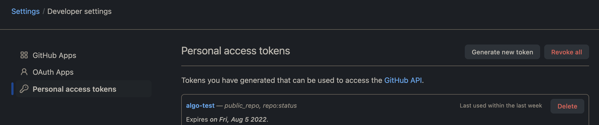

# GitHub Open Issues
Helper script that will help you list open issues for a particular repository.

## Goal
Using your language of choice, write a program that authenticates to the Github API, and queries for open issues with labels from a Github repository. Return issues with an array of labels. Response should be returned as JSON. Your program should take a parameter of the repository to query.

## Setup
In order to execute the script properly you will need to meet some prerequisites.

[JQ](https://stedolan.github.io/jq/) needs to be installed. On Mac simply use homebrew:
```sh
brew install jq
```

## Usage
A token only needs to be provided if you wish to list open issues for a private repository. The script will work without a token on public repos but unauthenticated clients are rate limited to `60` requests per hour.

The token can be provided with the `GITHUB_TOKEN` variable or passed into the script with the `-t` argument. Navigate to https://github.com/settings/tokens in order to genereate a tokenb, and make sure to give the token *only* the permissions that it requires.



> **NOTE:** It is more secure to use the environment variable instead of printing the token into you shell

```
Usage: $0 [-v] [-h] [-r repository-owner] [-r repository-name] [-t github-token]
Obtain a list of issues and their labels for a GitHub repository

-h,                Display help

-o,                (required) Set the GitHub repository owner, i.e. algorand

-r,                (required) Set the GitHub repository to obtain open issues from, i.e. go-algorand

-t,                (optional) GitHub token used to authenticate to the GitHub API

-v,                Run script in verbose mode. Will print out each step of execution.
```

**Example**
```
./github-issues.sh -o algorand -r go-algorand -t your-token-goes-here
```
